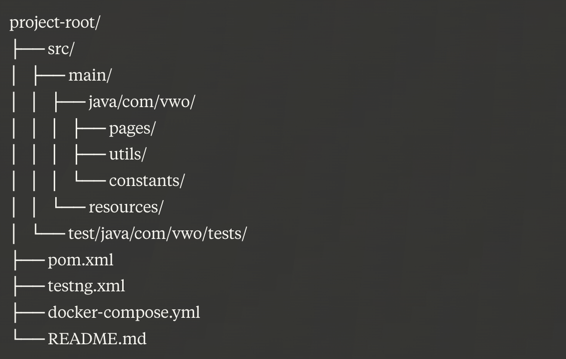

# VWO App Automation Framework

Author -  Abhishek Singh

This project is an automated testing framework for the VWO (Visual Website Optimizer) application, focusing on login functionality and dashboard verification. It's designed to run tests in parallel across multiple browsers using Selenoid.

## Features

- Java-based automation using Selenium WebDriver
- TestNG for test orchestration and parallel execution
- Page Object Model (POM) design pattern
- Data-driven testing with Excel
- Allure reporting
- Selenoid integration for remote execution
- Docker support
- Parallel execution on multiple browsers
- Thread-safe WebDriver management
- Configuration management using properties file

## Prerequisites

- Java JDK 11 or higher
- Maven
- Docker and Docker Compose
- Git

## Project Structure

## Setup

1. Clone the repository:
   git clone https://github.com/yourusername/vwo-automation.git
   cd vwo-automation
2. Update `src/main/resources/config.properties` with your VWO credentials and Selenoid URL.

3. Update `src/main/resources/testdata.xlsx` with your test data.

## Running Tests

1. Start Selenoid:
   docker-compose up -d
2. Run the tests:
   mvn clean test
   Copy
3. Generate and view Allure report:
   mvn allure:report
   mvn allure:serve

## Configuration

- `config.properties`: Contains application URL and Selenoid configuration
- `testng.xml`: Configures parallel execution and browser selection
- `docker-compose.yml`: Sets up Selenoid and Selenoid UI

## Key Components

- `DriverManager`: Manages WebDriver instances
- `ConfigReader`: Reads configuration from properties file
- `ExcelDataProvider`: Provides test data from Excel
- `LoginPage` and `DashboardPage`: Implement Page Object Model
- `LoginTest`: Contains test methods

## Acknowledgments

- [Selenium](https://www.selenium.dev/)
- [TestNG](https://testng.org/)
- [Allure Framework](https://docs.qameta.io/allure/)
- [Selenoid](https://aerokube.com/selenoid/)
- [Apache POI](https://poi.apache.org/)

